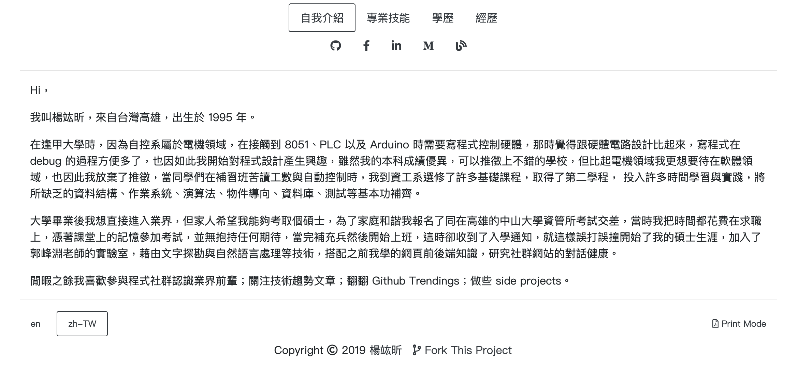
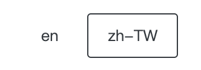
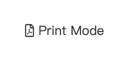
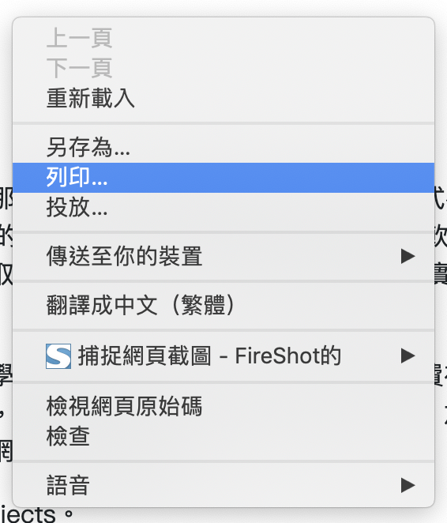
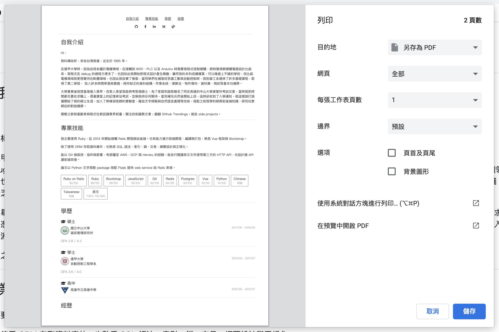

# me

Create a resume by writing a `.yml` file.



## Installation

1.  [Fork](https://github.com/jk195417/me/fork) this repository

2.  Clone it

    ```bash
    git clone https://github.com/$username/me.git
    cd me
    ```

3.  Using [Yarn](https://yarnpkg.com) to install dependencies

    ```bash
    yarn install
    ```

## Usage

1.  Replace my information with yours in `data/en.yml` and `data/zh-TW.yml`

2.  Each `$name.yml` file will create a **$name** version of resume. In my case, it will be **zh-TW** and **en**.

    Feel free to add a `.yml` file in this folder to create a new version of resume.

    

3.  Preview your resume in <http://localhost:1234>

    ```bash
    yarn start
    ```

### Download PDF

1.  Click **Print Mode** button (at the bottom right)

    

2.  Right click the browser and print it

    

3.  Save it as a `.pdf` file.

    

## Deployment

Deploy to your [Github Pages](https://pages.github.com)

```bash
yarn deploy
```

<http://$username.github.io/me>

## Build With

-   [Vue](https://vuejs.org) - JavaScript framework
-   [Bootstrap](https://getbootstrap.com) - Front-End component library
-   [Font Awesome](https://fontawesome.com) - Icons
-   [Day.js](https://github.com/iamkun/dayjs) - Date library
-   [Parcel](https://parceljs.org) - Pack and bundle modules
-   [gh-pages](https://github.com/tschaub/gh-pages) - publishing files to gh-pages branch

## Contributing

Bug reports and pull requests are welcome on GitHub at [repository](https://github.com/jk195417/me).

For major changes, please open an **issue** first to discuss what you would like to change.

## Code of Conduct

This project is intended to be a safe, welcoming space for collaboration, and contributors are expected to adhere to the [Contributor Covenant](http://contributor-covenant.org) code of conduct.

## Changelog

All notable changes to this project will be documented in this file.

The format is based on [Keep a Changelog](https://keepachangelog.com/en/1.0.0/), and this project adheres to [Semantic Versioning](https://semver.org/spec/v2.0.0.html).

You can read [CHANGELOG.md](./CHANGELOG.md) for more details.

## Authors

-   楊竑昕 <mailto:jk195417@gmail.com>

See also the list of [contributors](https://github.com/jk195417/me/graphs/contributors) who participated in this project.

## License

This project is available as open source under the terms of the [MIT License](https://opensource.org/licenses/MIT).

You can read [LICENSE.md](./LICENSE.md) for more details.
